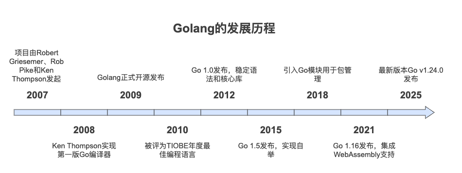
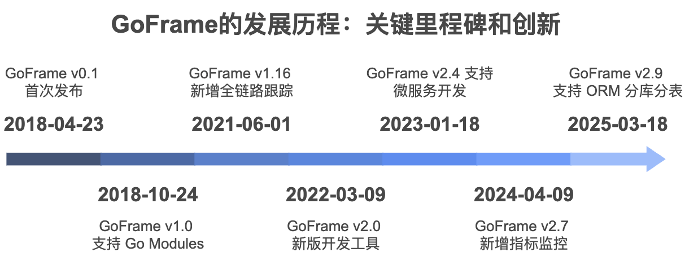
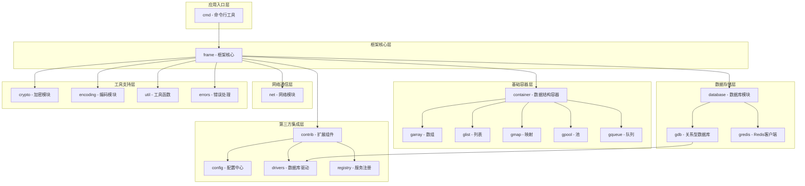

# 第一章 GoFrame基础介绍

## 1.1 GO语言介绍

Go（又称 *Golang*）是 Google 的 罗伯特·格瑞史莫Robert Griesemer，罗伯·派克Rob Pike 及 肯·汤普森Ken Thompson 开发的一种跨平台（Mac OS、Windows、Linux 等）静态强类型、编译型语言。由Ken Thompson联合创立，Unix操作系统的发明人之一（排在第一号）。

- docker，golang头号优秀项目，通过虚拟化技术实现的操作系统与应用的隔离，也称为容器；
- kubernetes，是来自 Google 云平台的开源容器集群管理系统。简称k8s，k8s和docker是当前容器化技术的重要基础设施；




**golang基础教程-快速入门go语言**

github:https://github.com/goflyfox/gostudy

gitee:https://gitee.com/flyfox/gostudy

**其他学习资料推荐**

Go by Example：https://gobyexample.com/

Go by Example（中文版）：https://gobyexample-cn.github.io/

Go语言101：https://gfw.go101.org/article/101.html

GoFrame推荐：https://goframe.org/preface

## 1.2 GoFrame基本介绍

**GoFrame官网**：https://goframe.org/

`GoFrame（GF）` 是一款模块化、高性能的`Go` 语言开发框架。 如果您想使用 `Golang` 开发一个业务型项目，无论是小型还是中大型项目，`GoFrame` 是您的不二之选。如果您想开发一个 `Golang` 组件库，`GoFrame` 提供开箱即用、丰富强大的基础组件库也能助您的工作事半功倍。 如果您是团队 `Leader`， `GoFrame` 丰富的资料文档、详尽的代码注释、 活跃的社区特点将会极大降低您的指导成本，支持团队快速接入、语言转型与能力提升。

### 1.2.1 发展历程



### 1.2.2 框架特点

强大的开发框架助您的项目快速成型、易于维护、事半功倍。

- 工程完备

- 开箱即用

- 性能卓越

- 跨平台性

- 松耦合性

- 高扩展性

- 详尽的开发文档

- 活跃的社区支持

- 优秀的错误处理

- 输入验证与过滤

- 代码生成工具链

- 自动化接口文档

- HTTP Web&微服务开发

- OpenTelemetry可观测性

- 更好的中文化支持

### 1.2.3 架构

**通过AI工具生成的架构图**


https://readmex.com/gogf/gf

https://deepwiki.com/gogf/gf

通过AI对话生成，架构图




### 1.2.4 使用场景

- **web项目**：有完备项目标准化流程，并可通过`gf-cli`生成；通过`OpenAPI`规范，自动化接口`Swagger API`文档；
- **微服务**：支持注册中心、负载均衡、配置管理、RPC、链路跟踪、指标监控。
- **命令行工具**：通过`gcmd`可以轻松构建命令行工具。
- **golang工具库**：配置管理`gcfg`、日志管理`glog`、错误处理`gerror`、数据校验`gvaild`、类型转换`gconv`，缓存管理`gcache`等

## 1.3 GoFrame代码

- **主库**：https://github.com/gogf/gf
- **码云**：https://gitee.com/johng/gf

目录结构及基本介绍：

```bash
gf
├── CONTRIBUTING.md
├── LICENSE
├── Makefile
├── README.MD
├── cmd   -- GoFrame CLI工具
│   └── gf
├── container  -- 基础类型：数组，列表、map、set、队列、环、树，类型处理和转换等
│   ├── garray
│   ├── gatomic
│   ├── glist
│   ├── gmap
│   ├── gpool
│   ├── gqueue
│   ├── gring
│   ├── gset
│   ├── gtree
│   └── gvar
├── contrib -- 社区服务：包括配置中心、注册中心、数据库驱动、Redis驱动、RPC、Metric和Trace等
│   ├── config
│   ├── drivers
│   ├── metric
│   ├── nosql
│   ├── registry
│   ├── rpc
│   ├── sdk
│   └── trace
├── crypto  -- 加密和解密：常用的MD5、AES、3DES、SHA
│   ├── gaes
│   ├── gcrc32
│   ├── gdes
│   ├── gmd5
│   └── gsha1
├── database  -- 数据库：关系型数据库（mysql，postgre，oracle）和redis
│   ├── gdb
│   └── gredis
├── debug    --  调试
│   └── gdebug
├── encoding  --编解码：常用的base64、json、配置文件解析等
│   ├── gbase64
│   ├── gbinary
│   ├── gcharset
│   ├── gcompress
│   ├── ghash
│   ├── ghtml
│   ├── gini
│   ├── gjson
│   ├── gproperties
│   ├── gtoml
│   ├── gurl
│   ├── gxml
│   └── gyaml
├── errors    -- 错误处理
│   ├── gcode
│   └── gerror
├── examples
├── frame  -- 核心框架：web、mvc、数据库、配置等常用单例对象
│   ├── g
│   └── gins
├── go.mod
├── go.sum
├── i18n       -- 国际化
│   └── gi18n
├── internal --   内部：空处理、锁、结构体等
│   ├── command
│   ├── consts
│   ├── deepcopy
│   ├── empty
│   ├── errors
│   ├── fileinfo
│   ├── httputil
│   ├── instance
│   ├── intlog
│   ├── json
│   ├── mutex
│   ├── reflection
│   ├── rwmutex
│   ├── tracing
│   └── utils
├── net   -- 网络：http、tcp、udp、openapi等
│   ├── gclient
│   ├── ghttp
│   ├── gipv4
│   ├── gipv6
│   ├── goai
│   ├── gsel
│   ├── gsvc
│   ├── gtcp
│   ├── gtrace
│   └── gudp
├── os   -- 系统：定时任务、命令行交互、日志、文件处理、缓存、session、时间处理等
│   ├── gbuild
│   ├── gcache
│   ├── gcfg
│   ├── gcmd
│   ├── gcron
│   ├── gctx
│   ├── genv
│   ├── gfile
│   ├── gfpool
│   ├── gfsnotify
│   ├── glog
│   ├── gmetric
│   ├── gmlock
│   ├── gmutex
│   ├── gproc
│   ├── gres
│   ├── grpool
│   ├── gsession
│   ├── gspath
│   ├── gstructs
│   ├── gtime
│   ├── gtimer
│   └── gview
├── test  -- 单元测试
│   └── gtest
├── text  -- 文本处理：正则、字符串处理
│   ├── gregex
│   └── gstr
├── util  -- 常用工具：类型转换、随机数、uuid、校验
│   ├── gconv
│   ├── gmeta
│   ├── gmode
│   ├── gpage
│   ├── grand
│   ├── gtag
│   ├── guid
│   ├── gutil
│   └── gvalid
└── version.go -- 版本文件

```

## 1.4 GoFrame交流

- QQ交流群：[797794069](https://qm.qq.com/q/K7UMKSrVq8)
- WX交流群：微信添加`389961817`群主，备注`GF`加群