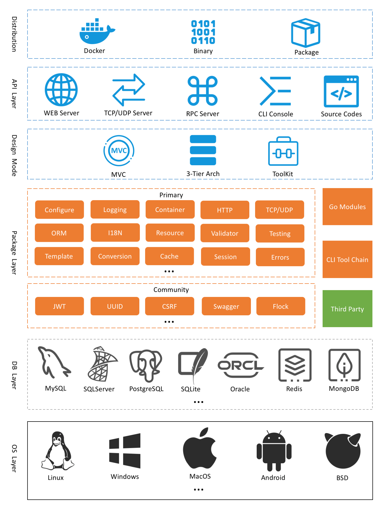

# GoFrame基础介绍

## 一、GO语言介绍

Go（又称 *Golang*）是 Google 的 Robert Griesemer，Rob Pike 及 Ken Thompson 开发的一种跨平台（Mac OS、Windows、Linux 等）静态强类型、编译型语言。由Ken Thompson（肯·汤普森）联合创立，Unix操作系统的发明人之一（排在第一号）。

- docker，golang头号优秀项目，通过虚拟化技术实现的操作系统与应用的隔离，也称为容器；

- kubernetes，是来自 Google 云平台的开源容器集群管理系统。简称k8s，k8s和docker是当前容器化技术的重要基础设施；


golang基础教程-快速入门go语言

github:https://github.com/goflyfox/gostudy

gitee:https://gitee.com/flyfox/gostudy

## 二、GF基本介绍

GF(Go Frame)是一款模块化、高性能、企业级的`Go`基础开发框架。实现了比较完善的基础设施建设以及开发工具链，提供了常用的基础开发模块，如：缓存、日志、队列、数组、集合、容器、定时器、命令行、内存锁、对象池、配置管理、资源管理、数据校验、数据编码、定时任务、数据库ORM、TCP/UDP组件、进程管理/通信等等。并提供了Web服务开发的系列核心组件，如：Router、Cookie、Session、Middleware、服务注册、模板引擎等等，支持热重启、热更新、域名绑定、TLS/HTTPS、Rewrite等特性。

## 三、GF特点

- 业内领先、工程完备
- 模块化、松耦合设计
- **组件丰富、开箱即用**
- **简洁易用、文档详尽**
- 接口化、高扩展性设计
- 全链路跟踪特性
- 全错误堆栈特性
- 接口化的错误码支持
- 稳健的工程设计规范
- 更便捷强大的ORM组件
- 便捷的开发工具、自动化代码生成
- 支持`OpenTelemetry`可观测性标准
- 自动化的接口文档生成，支持`OpenAPIV3`标准
- 完善的本地中文化支持
- 设计为团队及企业使用

## 四、GF地址

- **主库**：https://github.com/gogf/gf
- **码云**：https://gitee.com/johng/gf
- **GF官网：**https://goframe.org/index

目录结构及基本介绍：

```bash
GF
.
├── container  -- 基础类型：数组，通道，列表，map，队列，环，set，树，类型处理和转换
│   ├── garray
│   ├── glist
│   ├── gmap
│   ├── gpool
│   ├── gqueue
│   ├── gring
│   ├── gset
│   ├── gtree
│   ├── gtype
│   └── gvar
├── contrib
│   ├── config
│   ├── drivers
│   └── registry
├── crypto  -- 加密和解密：常用的md5，aes，3des
│   ├── gaes
│   ├── gcrc32
│   ├── gdes
│   ├── gmd5
│   └── gsha1
├── database  -- 数据库：关系型数据库（mysql，postgre，oracle）和redis
│   ├── gdb
│   └── gredis
├── debug    --  调试
│   └── gdebug
├── encoding  --编解码：常用的base64和json
│   ├── gbase64
│   ├── gbinary
│   ├── gcharset
│   ├── gcompress
│   ├── ghash
│   ├── ghtml
│   ├── gini
│   ├── gjson
│   ├── gproperties
│   ├── gtoml
│   ├── gurl
│   ├── gxml
│   └── gyaml
├── errors    -- 错误处理
│   ├── gcode
│   └── gerror
├── frame   -- 核心框架：web，mvc，常用的单例对象
│   ├── g
│   └── gins
├── go.mod
├── go.sum
├── i18n       -- 国际化
│   └── gi18n
├── internal --   内部：空处理，锁，结构体
│   ├── command
│   ├── consts
│   ├── deepcopy
│   ├── empty
│   ├── errors
│   ├── fileinfo
│   ├── httputil
│   ├── instance
│   ├── intlog
│   ├── json
│   ├── mutex
│   ├── reflection
│   ├── rwmutex
│   ├── tracing
│   └── utils
├── net   -- 网络：http，tcp，udp
│   ├── gclient
│   ├── ghttp
│   ├── gipv4
│   ├── gipv6
│   ├── goai
│   ├── gsel
│   ├── gsvc
│   ├── gtcp
│   ├── gtrace
│   └── gudp
├── os   -- 系统：定时任务，命令行交互，日志，文件处理，缓存，session，时间
│   ├── gbuild
│   ├── gcache
│   ├── gcfg
│   ├── gcmd
│   ├── gcron
│   ├── gctx
│   ├── genv
│   ├── gfile
│   ├── gfpool
│   ├── gfsnotify
│   ├── glog
│   ├── gmlock
│   ├── gmutex
│   ├── gproc
│   ├── gres
│   ├── grpool
│   ├── gsession
│   ├── gspath
│   ├── gstructs
│   ├── gtime
│   ├── gtimer
│   └── gview
├── test  -- 单元测试
│   └── gtest
├── text  -- 文本处理：正则，字符串处理
│   ├── gregex
│   └── gstr
├── util  -- 常用工具：类型转换，随机数，uuid，校验
│   ├── gconv
│   ├── gmeta
│   ├── gmode
│   ├── gpage
│   ├── grand
│   ├── gtag
│   ├── guid
│   ├── gutil
│   └── gvalid
└── version.go
```

## 五、GF架构



## 六、GF交流

- QQ交流群：[116707870](https://shang.qq.com/wpa/qunwpa?idkey=195f91eceeb5d7fa76009b7cd5a4641f70bf4897b7f5a520635eb26ff17adfe7)
- WX交流群：微信添加`389961817`备注`GF`加群