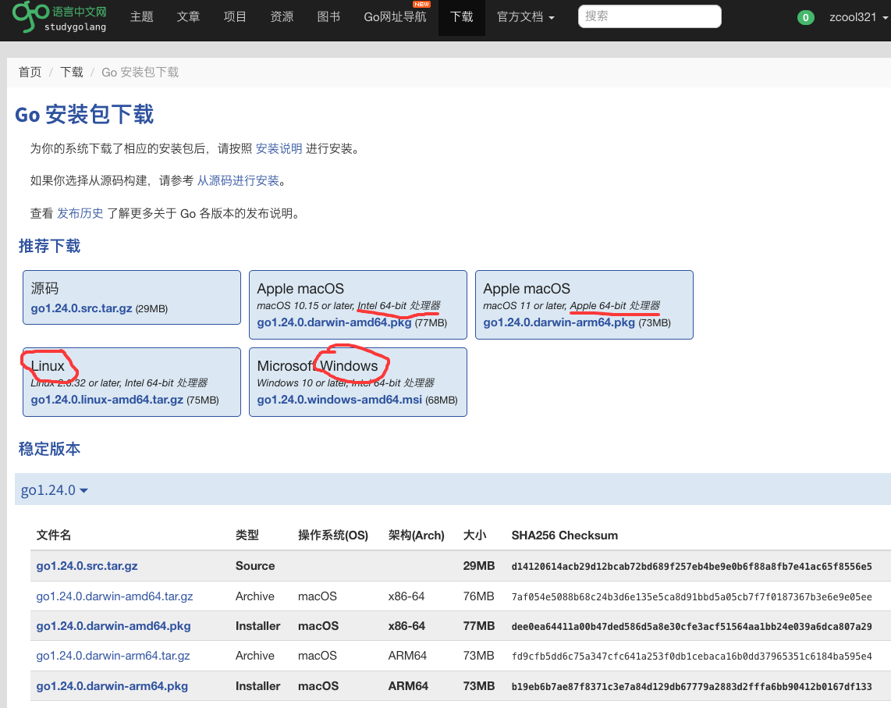
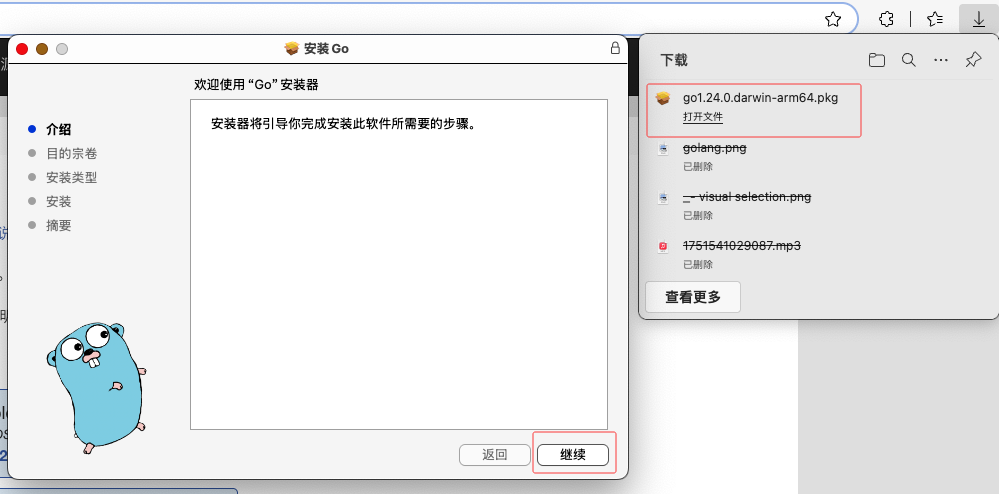
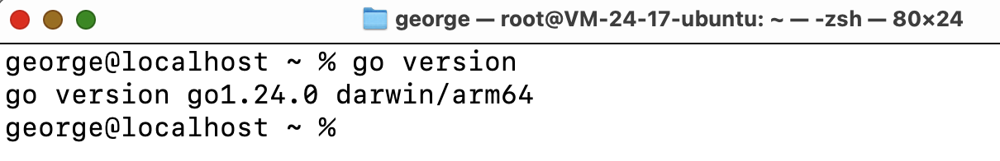
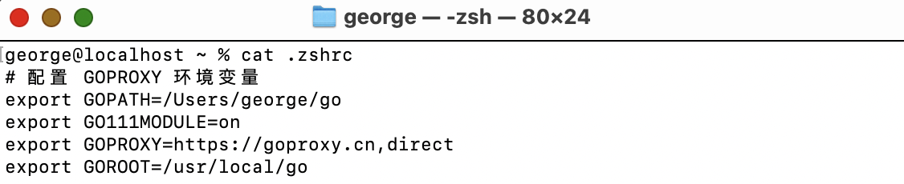
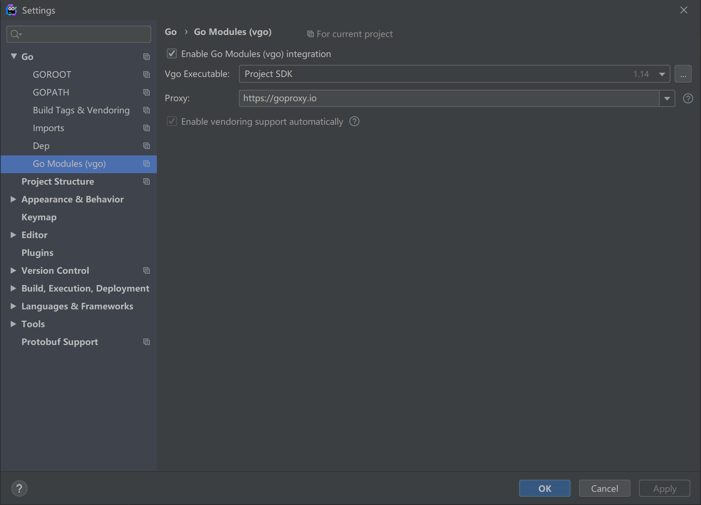
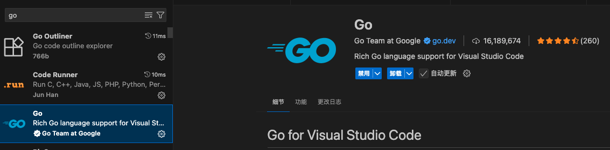

# GoFrame基础环境搭建

## 一、环境搭建

### 1）安装golang

1. 去中文社区下载安装golang：https://studygolang.com/dl；官网：https://golang.google.cn/dl/
2. 下载安装包
   1. windows：go{version}.windows-amd64.msi或者go.{version}.windows-amd64.zip包
   2. mac：苹果处理器 go{version}.darwin-amd64.pkg，Intel处理器go1.24.0.darwin-arm64.pkg 
   3. linux：go{version}.linux-amd64.tar.gz 



3. 安装golang



4. 此时打开cmd/bash窗口，运行`go version`即可展示安装golang版本



```go
# go version
go version go1.24.0 darwin/arm64
或
go version go1.24.0 windows/amd64
```

5. 查看环境变量：GOPATH、GOROOT、GOPROXY

```bash
# go env
GOPATH='/Users/george/go'
GOROOT='/Users/george/go'
GOPROXY='https://goproxy.cn,direct'
```

配置代理；不配置代理会访问国外地址，会很慢；建议使用以下三个地址：

- `https://goproxy.io`
- `https://goproxy.cn`
- `https://mirrors.aliyun.com/goproxy/`

如果没有需要配置环境变量

```bash
# windows设置环境，配置到系统环境变量
set GOPATH=D:\Project\GOPATH
set GOROOT=D:\Project\GO
set GOROOT=https://goproxy.cn,direct
set PATH=%PATH%;%GOROOT%\bin
# linux\mac设置环境，配置到系统profile中
export GOPATH=/Users/george/go
export GOROOT=/Users/george/go
export GOROOT=https://goproxy.cn,direct
export PATH=$PATH:$GOROOT$\bin
```

Mac 示例：



### 2）安装IDE（goland 或者 VSCode）

1. goland官网：https://www.jetbrains.com/go/
2. VSCode官网：https://code.visualstudio.com/
3. 安装、注册、购买
4. goland：首先打开File->Setting或者Ctrl+Alt+S,设置goroot和gopath，默认会获取环境变量配置



4. VSCode：安装golang插件



### 3)  了解go modules

go.mod`是Go项目的依赖描述文件：

```go
module hello

go 1.21

require github.com/gogf/gf/v2 v2.9.0
```

1. module是配置项目名称

2. go配置的是使用的golang版本

3. require配置引用第三方依赖包路径和版本，latest表示最新版本；

配置完编译成功后，生成`go.sum`依赖分析结果，里面会有当前所有的依赖详细信息；

##  二、运行验证

通过go.mod引用goframe，构建下载，打印版本号；项目文件如下：

### go.mod

```go
module hello

go 1.21

require github.com/gogf/gf/v2 v2.9.0
```

### hello.go

```go
package main

import (
	"fmt"
	"github.com/gogf/gf/v2"
	"github.com/gogf/gf/v2/crypto/gmd5"
)

func main() {
	fmt.Println("hello world!")
	fmt.Println(gf.VERSION)
	fmt.Println(gmd5.EncryptString("123456"))
}

```

## 三、搭建web项目

让我们来运行第一个web程序

### go.mod

```go
module gfweb

go 1.21

require github.com/gogf/gf/v2 v2.9.0
```

### main.go

```go
package main

import (
	"github.com/gogf/gf/v2/frame/g"
	"github.com/gogf/gf/v2/net/ghttp"
)

func main() {
	s := g.Server()
	s.BindHandler("/", func(r *ghttp.Request) {
		r.Response.Writeln("Welcome GoFrame!!!")
	})
	s.BindHandler("/hello", func(r *ghttp.Request) {
		r.Response.Writeln("Hello World!")
	})

	s.SetPort(8199)
	s.Run()
}
```

运行；然后打开浏览器，访问：http://127.0.0.1:8199/和http://127.0.0.1:8199/hello查看效果；

web应用开发就是如此简单~！~