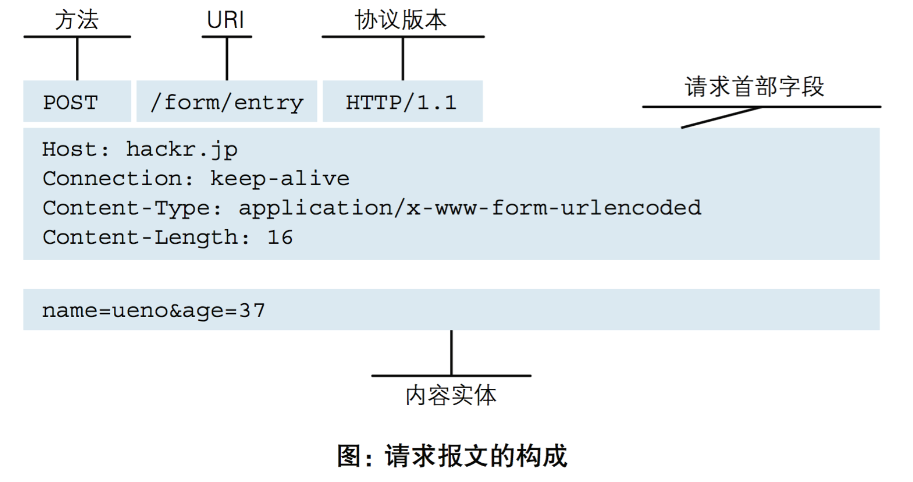

# 第三章 GoFrame的Web服务介绍

`GoFrame`框架提供了非常强大的`WebServer`，由`ghttp`模块实现。实现了丰富完善的相关组件，例如：Router、Cookie、Session、路由注册、配置管理、模板引擎、缓存控制等等，支持热重启、热更新、多域名、多端口、多实例、HTTPS、Rewrite等等特性。

HTTP协议书籍推荐：《HTTP权威指南》、《图解HTTP》。需要的也可以找我发PDF版本

>  *如果大家对HTTP协议比较熟悉，可以直接进入下一章节*

## 3.1 web基本介绍

电脑浏览器(Browser)就是**客户端**(Client)，大型的服务器就是**服务端**（Server）；浏览器发送HTTP请求，即客户端通过网络将需求发给服务端，然后服务端也是通过网络将数据发给客户端；


### 3.1.1 HTTP协议

超文本传输协议（英文：HyperText Transfer Protocol，缩写：HTTP）是一种用于分布式、协作式和超媒体信息系统的应用层协议。HTTP是万维网的数据通信的基础。

**核心作用**：规定了客户端（如浏览器）与服务器之间传输数据的格式和规则，实现网页、API等资源的请求与响应。  

### 3.1.2 请求（Request）的组成



```plaintext
请求方法 请求URL HTTP版本\r\n
请求头字段1: 值1\r\n
请求头字段2: 值2\r\n
...\r\n
\r\n
请求体（可选）
```

- **请求方法**：常用方法包括：  
  - `GET`：获取资源（如获取网页内容）。  
  - `POST`：提交数据（如表单提交）。  
- **请求头示例**：  
  - `User-Agent`：客户端标识（如浏览器类型）。  
  - `Content-Type`：请求体的数据类型（如`application/json`）。  
  - `Authorization`：认证信息（如Token）。  

### 3.1.3 响应（Response）的组成

###  

```plaintext
HTTP版本 状态码 状态描述\r\n
响应头字段1: 值1\r\n
响应头字段2: 值2\r\n
...\r\n
\r\n
响应体（资源内容，如HTML、JSON）
```

- **状态码分类**：  
  - **1xx（信息类）**：如100 Continue，表示请求已接收，继续处理。  
  - **2xx（成功类）**：如200 OK（请求成功）、201 Created（资源创建成功）。  
  - **3xx（重定向类）**：如301 Moved Permanently（永久重定向）、302 Found（临时重定向）。  
  - **4xx（客户端错误）**：如400 Bad Request（请求格式错误）、401 Unauthorized（未授权）、404 Not Found（资源不存在）。  
  - **5xx（服务器错误）**：如500 Internal Server Error（服务器内部错误）、502 Bad Gateway（网关错误）。  
- **响应头示例**：  
  - `Content-Type`：响应体的数据类型（如`text/html`）。  
  - `Content-Length`：响应体的字节长度。  
  - `Cache-Control`：缓存策略（如`max-age=3600`表示缓存1小时）。  

## 3.2 GoFrame搭建web项目

这里主要介绍基本项目启动和配置参数

### 3.2.1 目录结构

```bash
web:.
│  go.mod   -- go module
│  go.sum
│  main.go  -- 启动文件
│
├─config
│      config.yaml --配置文件
│
├─gflogs
│      2023-09-19.log -- gf系统日志
│      access-20230919.log -- 访问日志
│      error-20230919.log  -- 异常日志
│
├─logs
│      2023-09-19.log -- 业务日志
│
└─public
        hello.html -- 静态文件
        index.html -- 静态入口文件
```

### 3.2.2 main.go

```go
package main

import (
	"github.com/gogf/gf/v2/frame/g"
	"github.com/gogf/gf/v2/net/ghttp"
	"github.com/gogf/gf/v2/os/glog"
)

func main() {
	s := g.Server()
	
	// 测试日志
	s.BindHandler("/welcome", func(r *ghttp.Request) {
		g.Log().Info(r.GetCtx(), "你来了！")
		g.Log().Error(r.GetCtx(), "你异常啦！")
		r.Response.Write("哈喽世界！")
	})
	// 异常处理
	s.BindHandler("/panic", func(r *ghttp.Request) {
		g.Log().Panic(r.GetCtx(), "123")
	})
	// post请求
	s.BindHandler("POST:/hello", func(r *ghttp.Request) {
		r.Response.Writeln("Hello World!")
	})
	s.Run()
}
```

### 3.2.3 config.yaml

`GF`框架的核心组件均实现了便捷的文件配置管理方式，包括`Server`、日志组件、数据库ORM、模板引擎等等，非常强大便捷。

配置文件可参考：https://goframe.org/docs/web/server-config-file-template

```yaml
server:
  Address: :8199 # 端口号
  ServerRoot: public   # 静态目录
  IndexFiles: # 入口文件
    - index.html
    - hello.html
  AccessLogEnabled: true   # 系统访问日志
  ErrorLogEnabled: true    # 系统异常日志panic
  LogPath: gflogs    # 系统日志目录，启动，访问，异常
logger:
  path: logs   # 标准日志目录
  level: all   # 日志级别
```

## 3.3 启动日志

```bash
% mkdir goweb
% cd goweb 
% go mod init gfweb 
go: creating new go.mod: module gfweb
% ls
go.mod
% vi config.yaml
% vi main.go
% go get github.com/gogf/gf/v2
go: added github.com/gogf/gf/v2 v2.9.0
% go mod tidy
go: finding module for package github.com/kr/text
go: found github.com/kr/text in github.com/kr/text v0.2.0
% go run main.go 
2025-07-04T20:04:48.690+08:00 [FATA] SetServerRoot failed: cannot find "public" in following paths:
1. /Users/george/ws/go/goweb
2. /var/folders/7v/fr3gkb0s1jggs36lqd652frw0000gn/T/go-build125693734/b001/exe
1. cannot find "public" in following paths:
1. /Users/george/ws/go/goweb
2. /var/folders/7v/fr3gkb0s1jggs36lqd652frw0000gn/T/go-build125693734/b001/exe
   1).  main.main
        /Users/george/ws/go/goweb/main.go:10
 
Stack:
1.  main.main
    /Users/george/ws/go/goweb/main.go:10

exit status 1
% mkdir public
% go run main.go
2025-07-04T20:05:03.176+08:00 [DEBU] SetServerRoot path: /Users/george/ws/go/goweb/public
2025-07-04T20:05:03.177+08:00 [INFO] pid[61911]: http server started listening on [:8199]
2025-07-04T20:05:03.178+08:00 [INFO] openapi specification is disabled

  ADDRESS | METHOD |  ROUTE   |     HANDLER     | MIDDLEWARE  
----------|--------|----------|-----------------|-------------
  :8199   | POST   | /hello   | main.main.func3 |             
----------|--------|----------|-----------------|-------------
  :8199   | ALL    | /panic   | main.main.func2 |             
----------|--------|----------|-----------------|-------------
  :8199   | ALL    | /welcome | main.main.func1 |             
----------|--------|----------|-----------------|-------------

```

## 3.4 HTTP协议展示

**curl命令**

```bash
 % curl -v -X POST http://localhost:8199/hello
* Host localhost:8199 was resolved.
* IPv6: ::1
* IPv4: 127.0.0.1
*   Trying [::1]:8199...
* Connected to localhost (::1) port 8199
> POST /hello HTTP/1.1
> Host: localhost:8199
> User-Agent: curl/8.7.1
> Accept: */*
> 
* Request completely sent off
< HTTP/1.1 200 OK
< Server: GoFrame HTTP Server
< Trace-Id: 107d9445cdb84f187c530a335eeb7b65
< Date: Sun, 06 Jul 2025 17:12:51 GMT
< Content-Type: text/plain; charset=utf-8
< Transfer-Encoding: chunked
< 
Hello World!
* Connection #0 to host localhost left intact
```

**浏览器工具**：开发人员工具-->网络


