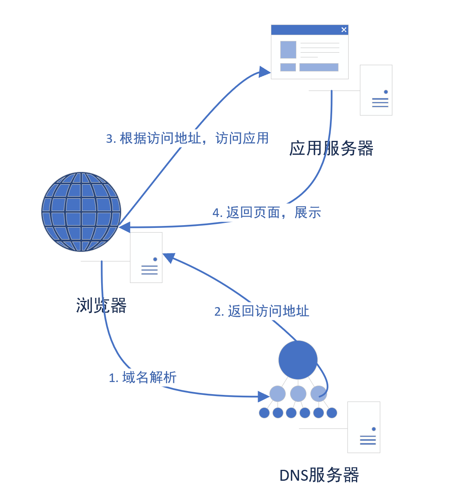

# GoFrame的Web服务介绍

`GF`框架提供了非常强大的`WebServer`，由`ghttp`模块实现。实现了丰富完善的相关组件，例如：Router、Cookie、Session、路由注册、配置管理、模板引擎、缓存控制等等，支持热重启、热更新、多域名、多端口、多实例、HTTPS、Rewrite等等特性。

## 一、web基本介绍

我们的电脑浏览器(Browser)就是**客户端**(Client)，大型的服务器就是**服务端**（Server）；浏览器发送HTTP请求，即客户端通过网络将需求发给服务端，然后服务端也是通过网络将数据发给客户端；



## 二、GF搭建web项目

这里主要介绍基本项目启动和配置参数

### 目录结构

```bash
web:.
│  go.mod   -- go module
│  go.sum
│  main.go  -- 启动文件
│
├─config
│      config.yaml --配置文件
│
├─gflogs
│      2023-09-19.log -- gf系统日志
│      access-20230919.log -- 访问日志
│      error-20230919.log  -- 异常日志
│
├─logs
│      2023-09-19.log -- 业务日志
│
└─public
        hello.html -- 静态文件
        index.html -- 静态入口文件
```

### main.go

```go
package main

import (
	"github.com/gogf/gf/v2/frame/g"
	"github.com/gogf/gf/v2/net/ghttp"
	"github.com/gogf/gf/v2/os/glog"
)

func main() {
	s := g.Server()
	g.Cfg()
	// 测试日志
	s.BindHandler("/welcome", func(r *ghttp.Request) {

		glog.Info(r.GetCtx(), "你来了！")
		glog.Error(r.GetCtx(), "你异常啦！")
		r.Response.Write("哈喽世界！")
	})
	// 异常处理
	s.BindHandler("/panic", func(r *ghttp.Request) {
		glog.Panic(r.GetCtx(), "123")
	})
	// post请求
	s.BindHandler("POST:/hello", func(r *ghttp.Request) {
		r.Response.Writeln("Hello World!")
	})
	s.Run()
}
```

### config.yaml

`GF`框架的核心组件均实现了便捷的文件配置管理方式，包括`Server`、日志组件、数据库ORM、模板引擎等等，非常强大便捷。

```yaml
server:
  Address: :8199 # 端口号
  ServerRoot: public   # 静态目录
  IndexFiles: # 入口文件
    - index.html
    - main.html
  AccessLogEnabled: true   # 系统访问日志
  ErrorLogEnabled: true    # 系统异常日志panic
  LogPath: gflogs    # 系统日志目录，启动，访问，异常
logger:
  path: logs   # 标准日志目录
  level: all   # 日志级别
```

