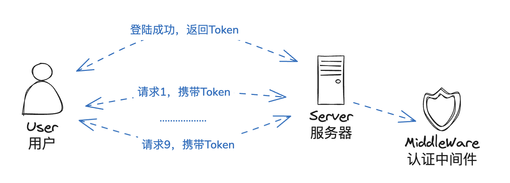

# 第六章 GoFrame中间件

## 6.1 中间件设计

`GoFrame` 提供了优雅的中间件请求控制方式， 该方式也是主流的 `WebServer` 提供的请求流程控制方式， 基于中间件设计可以为 `WebServer` 提供更灵活强大的插件机制。经典的中间件洋葱模型：


### 6.1.1 中间件定义

中间件的定义和普通HTTP执行方法 `HandlerFunc` 一样，但是可以在 `Request` 参数中使用 `Middleware` 属性对象来控制请求流程。

### 6.1.2 中间件类型

中间件的类型分为两种：前置中间件和后置中间件。前置即在路由服务函数调用之前调用，后置即在其后调用。

其定义类似于：

```go
func Middleware(r *ghttp.Request) {
    // 前置中间件：处理逻辑
    r.Middleware.Next()
    // 后置中间件：处理逻辑
}
```

### 6.1.3 全局中间件注册

```go
func (s *Server) Use(handlers ...HandlerFunc)
```

全局中间件是可以 **独立使用** 的请求拦截方法，通过路由规则的方式进行注册，绑定到 `Server` 上，由于中间件需要执行请求拦截操作，因此往往是使用"模糊匹配"或者"命名匹配"规则。

### 6.1.4 分组路由中间件

```go
func (g *RouterGroup) Middleware(handlers ...HandlerFunc) *RouterGroup
```

分组路由中注册的中间件绑定到当前分组路由中的所有的服务请求上，当服务请求被执行前会调用到其绑定的中间件方法。 分组路由仅有一个 `Middleware` 的中间件注册方法。分组路由中间件与全局中间件不同之处在于， **分组路由中间件无法独立使用**，必须在分组路由注册中使用，并且绑定到当前分组路由中所有的路由上作为路由方法的一部分。

### 6.1.5 执行优先级

由于全局中间件也是通过路由规则执行，那么也会存在执行优先级：

1. 首先，由于全局中间件是基于模糊路由匹配，因此 **当同一个路由匹配到多个中间件时，会按照路由的深度优先规则执行**，具体请查看路由章节；
2. 其次， **同一个路由规则下，会按照中间件的注册先后顺序执行**，中间件的注册方法也支持同时按照先后顺序注册多个中间件；
3. 最后，为避免优先级混淆和后续管理，建议将所有中间件放到同一个地方进行先后顺序注册来控制执行优先级；

示例：

```go
    // 分组注册及中间件
	group := s.Group("/api")
	group.Middleware(MiddlewareTest)
	group.ALL("/all", func(r *ghttp.Request) {
		r.Response.Writeln("all")
	})
```

## 6.2 使用场景

- 跨域处理

- 请求限流

- 鉴权处理

- 统一异常日志

- 返回值格式化


### 6.2.1 允许跨域处理

**为什么会出现跨域问题**

出于浏览器的同源策略限制。同源策略（Sameoriginpolicy）是一种约定，它是浏览器最核心也最基本的安全功能，如果缺少了同源策略，则浏览器的正常功能可能都会受到影响。可以说Web是构建在同源策略基础之上的，浏览器只是针对同源策略的一种实现。同源策略会阻止一个域的javascript脚本和另外一个域的内容进行交互。所谓同源（即指在同一个域）就是两个页面具有相同的协议（protocol），主机（host）和端口号（port）

**什么是跨域**

当一个请求url的协议、域名、端口三者之间任意一个与当前页面url不同即为跨域

| 当前页面url             | 被请求页面url                     | 是否跨域 | 原因                           |
| ----------------------- | --------------------------------- | -------- | ------------------------------ |
| https://www.jflyfox.cn/ | https://www.jflyfox.cn/index.html | 否       | 同源（协议、域名、端口号相同） |
| http://www.jflyfox.cn/  | https://www.jflyfox.cn            | 跨域     | 协议不同（http/https）         |
| https://www.jflyfox.cn/ | http://www.baidu.com/             | 跨域     | 主域名不同（test/baidu）       |
| https://www.jflyfox.cn/ | http://blog.test.com/             | 跨域     | 子域名不同（www/blog）         |
| https://www.jflyfox.cn/ | https://www.jflyfox.cn:7001/      | 跨域     | 端口号不同（80/7001）          |

**跨域示例代码**

```go
func MiddlewareCORS(r *ghttp.Request) {
    r.Response.CORSDefault()
    r.Middleware.Next()
}

func main() {
    s := g.Server()
    s.Group("/api.v2", func(group *ghttp.RouterGroup) {
        group.Middleware(MiddlewareCORS)
        group.ALL("/user/list", func(r *ghttp.Request) {
            r.Response.Writeln("list")
        })
    })
    s.Run()
}
```

### 6.2.2 请求鉴权处理

登陆之后，需要每次都对访问进行用户认证，可以统一使用鉴权中间件处理。



示例如下：

```go
func MiddlewareAuth(r *ghttp.Request) {
    token := r.Get("token")
    if token.String() == "123456" {
        r.Response.Writeln("auth")
        r.Middleware.Next()
    } else {
        r.Response.WriteStatus(http.StatusForbidden)
    }
}

func main() {
    s := g.Server()
    s.Group("/api.v2", func(group *ghttp.RouterGroup) {
        group.Middleware(MiddlewareAuth)
        group.ALL("/user/list", func(r *ghttp.Request) {
            r.Response.Writeln("list")
        })
    })
    s.Run()
}
```

## 6.3 教程示例


```go
package main

import (
	"context"
	"github.com/gogf/gf/v2/frame/g"
	"github.com/gogf/gf/v2/net/ghttp"
)

type HelloReq struct {
	g.Meta `path:"/hello" method:"get"`
}
type HelloRes struct {
}

type Hello struct{}

func (Hello) Say(ctx context.Context, req *HelloReq) (res *HelloRes, err error) {
	g.Log().Info(ctx, "中")
	return
}

func RequestHandle1(r *ghttp.Request) {
	g.Log().Info(r.GetCtx(), "前1")
	r.Middleware.Next()
	g.Log().Info(r.GetCtx(), "前1结束")
}

func RequestHandle2(r *ghttp.Request) {
	g.Log().Info(r.GetCtx(), "前2")
	r.Middleware.Next()
	g.Log().Info(r.GetCtx(), "前2结束")
}

func RequestHandle3(r *ghttp.Request) {
	g.Log().Info(r.GetCtx(), "前3")
	r.Middleware.Next()
	g.Log().Info(r.GetCtx(), "前3结束")
}

func RequestHandle4(r *ghttp.Request) {
	g.Log().Info(r.GetCtx(), "前4")
	r.Middleware.Next()
	g.Log().Info(r.GetCtx(), "前4结束")
}

func ResponseHandle1(r *ghttp.Request) {
	r.Middleware.Next()
	g.Log().Info(r.GetCtx(), "后1")
}

func ResponseHandle2(r *ghttp.Request) {
	r.Middleware.Next()
	g.Log().Info(r.GetCtx(), "后2")
}

func ResponseHandle3(r *ghttp.Request) {
	r.Middleware.Next()
	g.Log().Info(r.GetCtx(), "后3")
}

func ResponseHandle4(r *ghttp.Request) {
	r.Middleware.Next()
	g.Log().Info(r.GetCtx(), "后4")
}

func main() {
	s := g.Server()
	s.Use(ghttp.MiddlewareHandlerResponse)
	s.Group("/", func(group *ghttp.RouterGroup) {
		// 前置中间件
		group.Middleware(RequestHandle1)
		group.Middleware(RequestHandle2)

		// 后置中间件
		group.Middleware(ResponseHandle1)
		group.Middleware(ResponseHandle2)

		group.Group("/sub", func(group *ghttp.RouterGroup) {
			// 前置中间件
			group.Middleware(RequestHandle3)
			group.Middleware(RequestHandle4)

			// 后置中间件
			group.Middleware(ResponseHandle3)
			group.Middleware(ResponseHandle4)

			group.Bind(new(Hello))
		})
	})
	s.Run()
}

```

访问结果：

```go
### 中间件
GET http://localhost:8199/sub/hello
```

