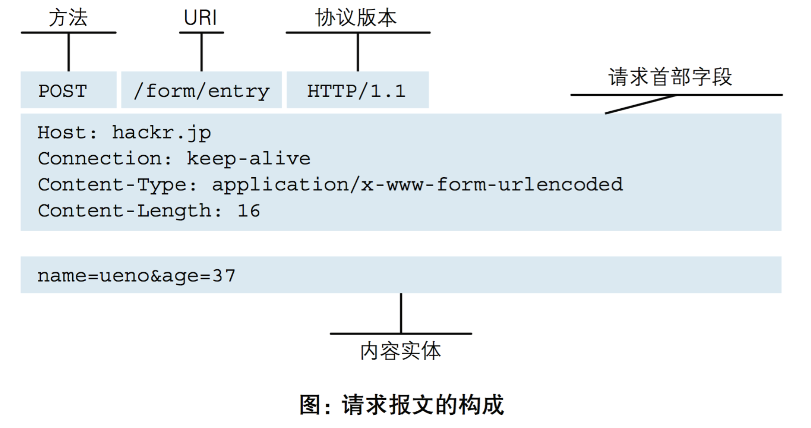
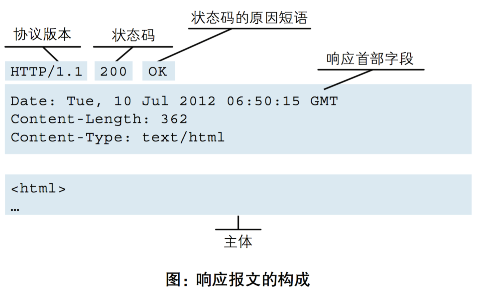
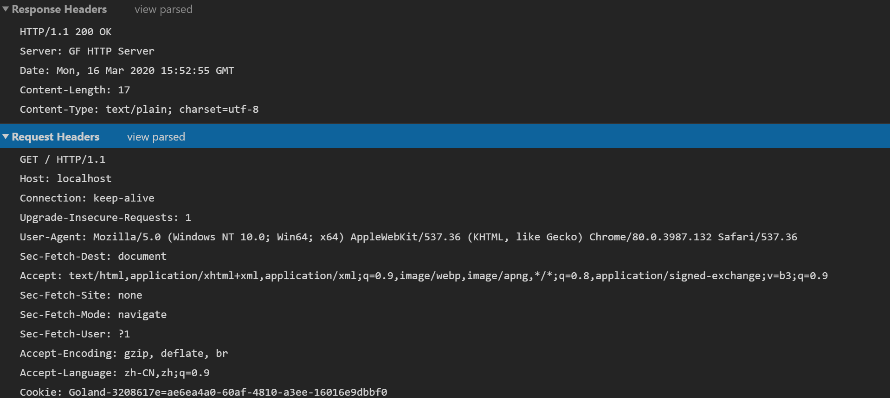

# 第七章 GoFrame的HTTP客户端

## 一、HTTP协议介绍

超文本传输协议（英文：**H**yper**T**ext **T**ransfer **P**rotocol，缩写：HTTP）是一种用于分布式、协作式和超媒体信息系统的应用层协议。HTTP是万维网的数据通信的基础。

请求：



响应：



放问GF启动的网址，通过Chrome F12查看NetWork中的URL；



**优点：简单方便，浏览器支持完善，工具链成熟；**

## 二、GF的HTTP客户端

这个先启动一个gf的http server，然后我们通过go test 来测试ghttp client；

### main.go

```go
package main

import (
	"github.com/gogf/gf/v2/frame/g"
	"github.com/gogf/gf/v2/net/ghttp"
)

func main() {
	s := g.Server()
	group := s.Group("/api")
	// 默认路径
	group.ALL("/", func(r *ghttp.Request) {
		r.Response.Writeln("Welcome GoFrame!")
	})
	// GET带参数
	group.GET("/hello", func(r *ghttp.Request) {
		r.Response.Writeln("Hello World!")
		r.Response.Writeln("name:", r.Get("name").String())
	})
	// POST KV
	group.POST("/test", func(r *ghttp.Request) {
		r.Response.Writeln("func:test")
		r.Response.Writeln("name:", r.Get("name").String())
		r.Response.Writeln("age:", r.Get("age").Int())
	})
	// POST JSON
	group.POST("/test2", func(r *ghttp.Request) {
		r.Response.Writeln("func:test2")
		r.Response.Writeln("passport:", r.Get("passport").String())
		r.Response.Writeln("password:", r.Get("password").String())
	})
	// POST Header
	group.POST("/test3", func(r *ghttp.Request) {
		r.Response.Writeln("func:test3")
		r.Response.Writeln("Cookie:", r.Header.Get("Cookie"))
	})
	// POST Header
	group.POST("/test4", func(r *ghttp.Request) {
		r.Response.Writeln("func:test4")
		h := r.Header
		r.Response.Writeln("accept-encoding:", h.Get("accept-encoding"))
		r.Response.Writeln("accept-language:", h.Get("accept-language"))
		r.Response.Writeln("referer:", h.Get("referer"))
		r.Response.Writeln("cookie:", h.Get("cookie"))
		r.Response.Writeln(r.Cookie.Map())
	})

	s.SetPort(8199)
	s.Run()
}
```

### client_test.go

单元测试源码文件可以由多个测试用例组成，每个测试用例函数需要以`Test`为前缀，例如：

func TestXXX( t *testing.T )

- 测试用例文件不会参与正常源码编译，不会被包含到可执行文件中。
- 测试用例文件使用`go test`指令来执行，没有也不需要 main() 作为函数入口。所有在以`_test`结尾的源码内以`Test`开头的函数会自动被执行。
- 测试用例可以不传入 *testing.T 参数。

```go
package test

import (
	"fmt"
	"github.com/gogf/gf/v2/frame/g"
	"github.com/gogf/gf/v2/os/gctx"
	"testing"
)

var path = "http://127.0.0.1:8199/api"

// GET请求
func TestGet(t *testing.T) {
	ctx := gctx.New()
	if response, err := g.Client().Get(ctx, path); err != nil {
		panic(err)
	} else {
		defer response.Close()
		t.Log(response.ReadAllString())
	}
	if response, err := g.Client().Post(ctx, path); err != nil {
		panic(err)
	} else {
		defer response.Close()
		t.Log(response.ReadAllString())
	}
}

// GET请求带参数
func TestHello(t *testing.T) {
	if response, err := g.Client().Get(gctx.New(), path+"/hello?name=whoami"); err != nil {
		panic(err)
	} else {
		defer response.Close()
		t.Log(response.ReadAllString())
	}
}

// POST请求
func TestPost(t *testing.T) {
	if response, err := g.Client().Post(gctx.New(), path+"/test", "name=john&age=18"); err != nil {
		panic(err)
	} else {
		defer response.Close()
		t.Log(response.ReadAllString())
	}
}

// POST JSON
func TestPostJson(t *testing.T) {
	if response, err := g.Client().Post(gctx.New(), path+"/test2",
		`{"passport":"john","password":"123456"}`); err != nil {
		panic(err)
	} else {
		defer response.Close()
		t.Log(response.ReadAllString())
	}
}

// POST Header头
func TestPostHeader(t *testing.T) {
	c := g.Client()
	c.SetHeader("Cookie", "name=john; score=100")
	if r, e := c.Post(gctx.New(), path+"/test3"); e != nil {
		panic(e)
	} else {
		fmt.Println(r.ReadAllString())
	}
}

// POST Header头
func TestPostHeader2(t *testing.T) {
	c := g.Client()
	c.SetHeaderRaw(`
accept-encoding: gzip, deflate, br
accept-language: zh-CN,zh;q=0.9,en;q=0.8
referer: https://idonottell.you
cookie: name=john; score=100
user-agent: my test http client
 	`)
	if r, e := c.Post(gctx.New(), path+"/test4"); e != nil {
		panic(e)
	} else {
		fmt.Println(r.ReadAllString())
	}
}
```


**最后，建议初学者搜索下 HTTP协议进行学习；**