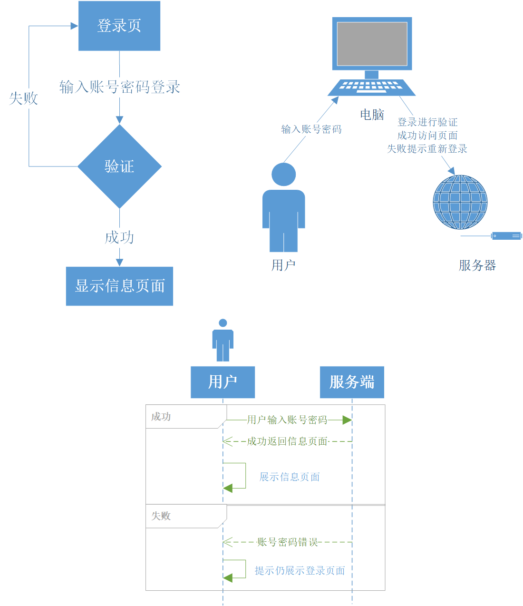

# GoFrame实战之登录基本介绍

## 一、登录介绍

登录简单来说就是客户端输入账号密码，服务端进行账号密码验证，通过可访问系统，不通过停留在登录页面不能访问系统；登录看似简单的流程，但是实际还是有许多知识点是值得我们学习的；


实践是检验真理的唯一标准。希望大家可以多跟练习，多去体会，多去思考，而不是简单的听；这节课开始不仅仅是GoFrame的使用，也有一些其他的重要知识点和实操，但示例还是主要以GoFrame为基础；

下面我们来简单介绍一下设计相关的线框图，流程图和时序图；这里我使用的visio，大家也可以使用亿图，在线ProcessOn。



## 二、GoFrame模板引擎

模板引擎（这里特指用于Web开发的模板引擎）是为了使用户界面与业务数据（内容）分离而产生的，它可以生成特定格式的文档，用于网站的模板引擎就会生成一个标准的HTML文档。

但模板引擎不属于特定技术领域，它是跨领域跨平台的概念。

模板配置config.toml

```toml
# 模板引擎配置
[viewer]
    Path        = "template"
    DefaultFile = "index.html"
    Delimiters  =  ["${", "}"]
```

模板使用

```go
// 调用文件
s := g.Server()
s.BindHandler("/template", func(r *ghttp.Request) {
    r.Response.WriteTpl("index.tpl", g.Map{
        "id":   123,
        "name": "john",
    })
})
// 直接传入字符串
s := g.Server()
s.BindHandler("/template", func(r *ghttp.Request){
    tplContent := `id:{{.id}}, name:{{.name}}`
    r.Response.WriteTplContent(tplContent, g.Map{
        "id"   : 123,
        "name" : "john",
    })
})
```

模板常用标签

```html
<!-- 取值 -->
{{ .value }}
<!-- 判断 -->
{{if .condition}}
    ...
{{else if .condition2}}
    ...
{{else}}
    ...
{{end}}
<!-- 遍历 -->
{{range $index, $elem := .SliceContent}}
    {{range $key, $value := $elem}}
        {{$key}}:{{$value}}
    {{end}}
{{end}}
<!-- 引用文件 -->
{{include "模板文件名(需要带完整文件名后缀)" .}}
```

其实模板可以当做一种语言来讲，这里不做过多介绍，一般使用模板只用一些基本功能，但是要想深入了解建议去看go模板和GoFram官网模板章节；

## 三、登录示例

### 目录结构

```bash
:.
│  go.mod
│  go.sum
│  main.go
│
├─config
│      config.toml
│
└─template
        index.html
        user_index.html
```

### go.mod

```bash
module gf-login11

go 1.14

require github.com/gogf/gf v1.12.1
```

### main.go

```
package main

import (
	"github.com/gogf/gf/frame/g"
	"github.com/gogf/gf/net/ghttp"
)

func main() {
	s := g.Server()
	// 常规注册
	group := s.Group("/")
	group.GET("/", func(r *ghttp.Request) {
		r.Response.WriteTpl("index.html", g.Map{
			"title": "登录页面",
		})
	})
	group.POST("/login", func(r *ghttp.Request) {
		username := r.GetString("username")
		password := r.GetString("password")

		//dbUsername := "admin"
		//dbPassword := "123456"
		dbUsername := g.Config().GetString("username")
		dbPassword := g.Config().GetString("password")
		if username == dbUsername && password == dbPassword {
			r.Response.WriteJson(g.Map{
				"code": 0,
				"msg":  "登录成功",
			})
			r.Exit()
		}

		r.Response.WriteJson(g.Map{
			"code": -1,
			"msg":  "登录失败",
		})
	})
	group.GET("/user/index", func(r *ghttp.Request) {
		r.Response.WriteTpl("user_index.html", g.Map{
			"title": "登录页面",
		})
	})
	group.POST("/user/list", func(r *ghttp.Request) {
		r.Response.WriteJson(g.Map{
			"code": 0,
			"msg":  "成功",
			"data": g.List{
				g.Map{
					"date":    "2020-04-01",
					"name":    "朱元璋",
					"address": "江苏110号",
				},
				g.Map{
					"date":    "2020-04-02",
					"name":    "徐达",
					"address": "江苏111号",
				},
				g.Map{
					"date":    "2020-04-03",
					"name":    "李善长",
					"address": "江苏112号",
				},
			}})
	})
	group.POST("/logout", func(r *ghttp.Request) {
		r.Response.WriteJson(g.Map{
			"code": 0,
			"msg":  "登出成功",
		})
	})

	s.SetPort(8199)
	s.Run()
}
```

### 页面index.html

```html
<!DOCTYPE html>
<html>
<head>
    <meta charset="UTF-8">
    <!-- import CSS -->
    <link rel="stylesheet" href="https://unpkg.com/element-ui/lib/theme-chalk/index.css">
    <style>
        .el-row {
            margin-bottom: 20px;
        }
    </style>
</head>
<body>
<div id="app">
    <el-row>
        <el-col :span="6" :offset="6" style="text-align: center">
            <span>${ .title }</span>
        </el-col>
    </el-row>
    <el-row>
        <el-col :span="6" :offset="6">
            <el-input v-model="username" placeholder="请输入内容"></el-input>
        </el-col>
    </el-row>
    <el-row>
        <el-col :span="6" :offset="6">
            <el-input placeholder="请输入密码" v-model="password" show-password></el-input>
        </el-col>
    </el-row>
    <el-row>
        <el-col :span="6" :offset="6" style="text-align: center">
            <el-button @click="login">登录</el-button>
        </el-col>
    </el-row>


</div>
</body>
<!-- import Vue before Element -->
<script src="https://unpkg.com/vue/dist/vue.js"></script>
<!-- import JavaScript -->
<script src="https://unpkg.com/element-ui/lib/index.js"></script>

<script src="https://cdn.bootcss.com/axios/0.19.2/axios.min.js"></script>

<script>
    new Vue({
        el: '#app',
        data: function () {
            return {
                visible: false,
                username: '',
                password: ''
            }
        },
        methods: {
            login: function () {
                axios.post('/login', {       // 还可以直接把参数拼接在url后边
                    username: this.username,
                    password: this.password
                }).then(function (res) {
                    console.log(res.data)
                    if (res.data.code == 0) {
                        alert(res.data.msg)
                        window.location.href = "/user/index"
                    } else {
                        alert("失败：" + res.data.msg)
                    }
                }).catch(function (error) {
                    console.log(error);
                });
            }
        }
    })
</script>
</html>
```

### 页面user_index.html

```html
<!DOCTYPE html>
<html>
<head>
    <meta charset="UTF-8">
    <!-- import CSS -->
    <link rel="stylesheet" href="https://unpkg.com/element-ui/lib/theme-chalk/index.css">
    <style>
        .el-row {
            margin-bottom: 20px;
        }
    </style>
</head>
<body>
<div id="app">
    <el-row>
        <el-col :span="24">
            <template>
                <el-table
                        :data="tableData"
                        style="width: 100%">
                    <el-table-column
                            prop="date"
                            label="日期"
                            width="180">
                    </el-table-column>
                    <el-table-column
                            prop="name"
                            label="姓名"
                            width="180">
                    </el-table-column>
                    <el-table-column
                            prop="address"
                            label="地址">
                    </el-table-column>
                </el-table>
            </template>
        </el-col>
    </el-row>
    <el-row>
        <el-col :span="6" :offset="6" style="text-align: center">
            <el-button @click="logout">登出</el-button>
        </el-col>
    </el-row>


</div>
</body>
<!-- import Vue before Element -->
<script src="https://unpkg.com/vue/dist/vue.js"></script>
<!-- import JavaScript -->
<script src="https://unpkg.com/element-ui/lib/index.js"></script>

<script src="https://cdn.bootcss.com/axios/0.19.2/axios.min.js"></script>

<script>
    var vm = new Vue({
        el: '#app',
        data: {
            visible: false,
            tableData: [{
                date: '2016-05-02',
                name: '王小虎',
                address: '上海市普陀区金沙江路 1518 弄'
            }]
        },
        methods: {
            list: function () {
                axios.post('/user/list', {}).then(function (res) {
                    console.log(res.data)
                    if (res.data.code == 0) {
                        vm.tableData = res.data.data
                    } else {
                        alert("失败：" + res.data.msg)
                    }
                }).catch(function (error) {
                    console.log(error);
                });
            },
            logout: function () {
                axios.post('/logout', {}).then(function (res) {
                    console.log(res.data)
                    if (res.data.code == 0) {
                        alert(res.data.msg)
                        window.location.href = "/"
                    } else {
                        alert("失败：" + res.data.msg)
                    }
                }).catch(function (error) {
                    console.log(error);
                });
            }
        },
        mounted: function () {
            this.list();
        }
    })
</script>
</html>
```

