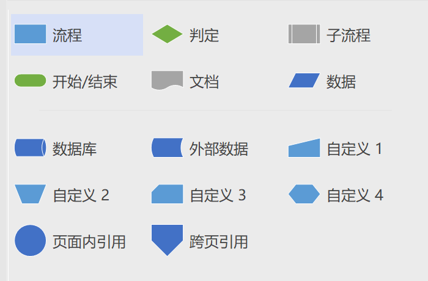
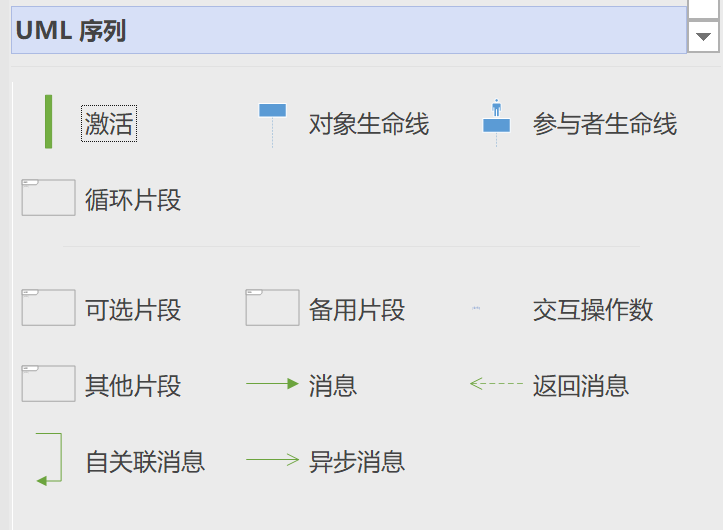
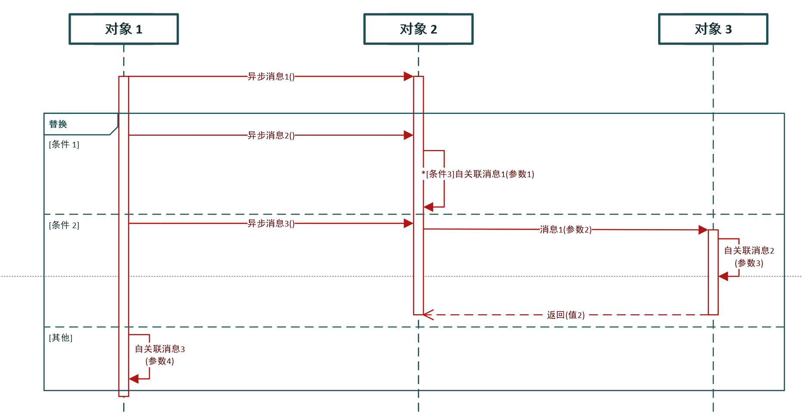
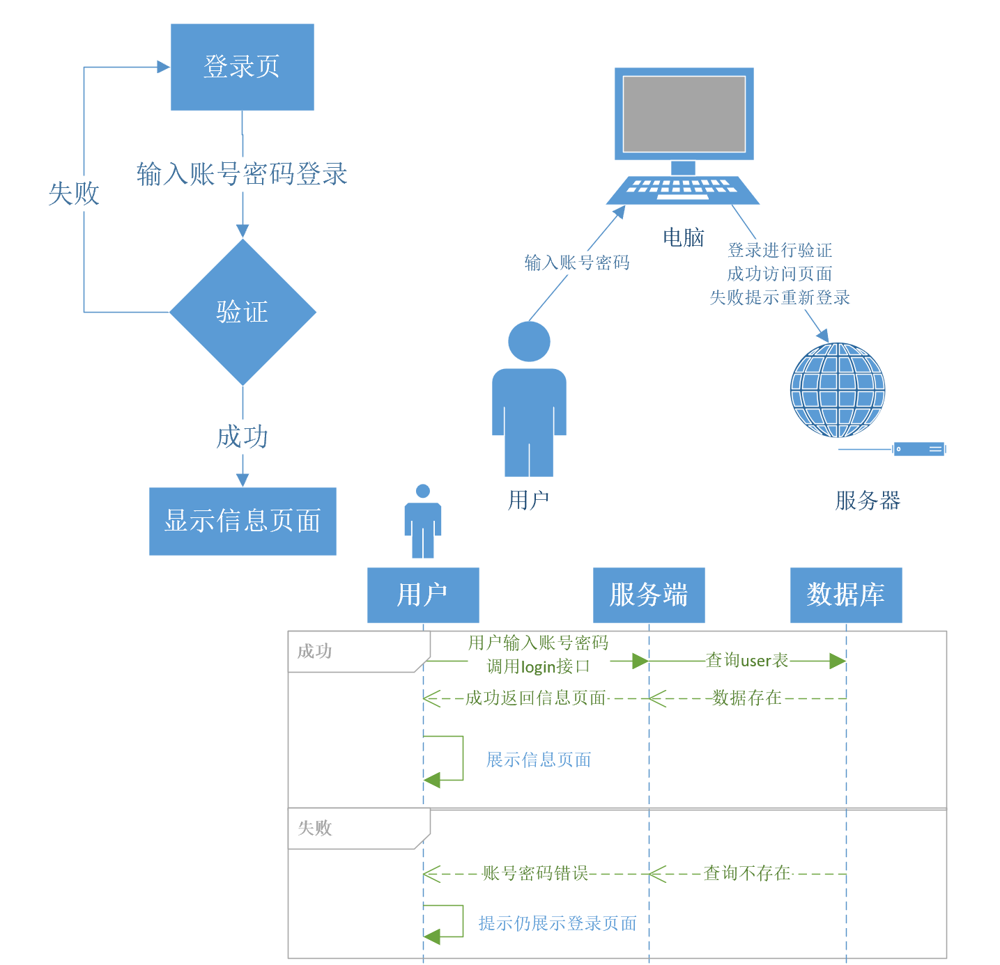

# GoFrame登录实战之登录流程

## 一、登录介绍

登录简单来说就是客户端输入账号密码，服务端进行账号密码验证，通过可访问系统，不通过停留在登录页面不能访问系统；登录看似简单的流程，但是实际还是有许多知识点是值得我们学习的；

## 二、登录流程图

下面我们来简单介绍一下设计相关的线框图，流程图和时序图；这里我使用的visio，大家也可以使用亿图，在线ProcessOn。

### 基本流程图



基本流程图主要就是开始结束，流程处理，判断判断，数据，文档等；

### UML序列



UML时序图主要是对象，请求，响应，自关联，循环，可选；




### 示例




## 三、GoFrame登录示例

### 目录结构

```bash
:.
│  go.mod
│  go.sum
│  main.go
│
├─config
│      config.yaml
│
└─template
        index.html
        user_index.html
```

### go.mod

```bash
module gf-login11

go 1.21

require github.com/gogf/gf/v2 v2.6.2
```

### main.go

```
package main

import (
	"github.com/gogf/gf/v2/frame/g"
	"github.com/gogf/gf/v2/net/ghttp"
)

func main() {
	s := g.Server()
	// 常规注册
	group := s.Group("/")
	// 登录页面
	group.GET("/", func(r *ghttp.Request) {
		r.Response.WriteTpl("index.html", g.Map{
			"title": "登录页面",
		})
	})
	// 登录接口
	group.POST("/login", func(r *ghttp.Request) {
		username := r.Get("username").String()
		password := r.Get("password").String()

		//dbUsername := "admin"
		//dbPassword := "123456"
		dbUsername := g.Config().MustGet(r.GetCtx(), "username").String()
		dbPassword := g.Config().MustGet(r.GetCtx(), "password").String()
		if username == dbUsername && password == dbPassword {
			r.Response.WriteJson(g.Map{
				"code": 0,
				"msg":  "登录成功",
			})
			r.Exit()
		}

		r.Response.WriteJson(g.Map{
			"code": -1,
			"msg":  "登录失败",
		})
	})
	// 列表页面
	group.GET("/user/index", func(r *ghttp.Request) {
		r.Response.WriteTpl("user_index.html", g.Map{
			"title": "列表页面",
			"dataList": g.List{
				g.Map{
					"date":    "2020-04-01",
					"name":    "朱元璋",
					"address": "江苏110号",
				},
				g.Map{
					"date":    "2020-04-02",
					"name":    "徐达",
					"address": "江苏111号",
				},
				g.Map{
					"date":    "2020-04-03",
					"name":    "李善长",
					"address": "江苏112号",
				},
			}})
	})
	// 登出接口
	group.POST("/logout", func(r *ghttp.Request) {
		r.Response.WriteJson(g.Map{
			"code": 0,
			"msg":  "登出成功",
		})
	})

	s.Run()
}
```

### 页面index.html

```html
<!DOCTYPE html>
<html>
<head>
    <meta charset="UTF-8">
    <!-- import CSS -->
    <link rel="stylesheet" href="https://unpkg.com/element-ui/lib/theme-chalk/index.css">
    <style>
        .el-row {
            margin-bottom: 20px;
        }
    </style>
</head>
<body>
<div id="app">
    <el-row>
        <el-col :span="6" :offset="6" style="text-align: center">
            <span>${ .title }</span>
        </el-col>
    </el-row>
    <el-row>
        <el-col :span="6" :offset="6">
            <el-input v-model="username" placeholder="请输入内容"></el-input>
        </el-col>
    </el-row>
    <el-row>
        <el-col :span="6" :offset="6">
            <el-input placeholder="请输入密码" v-model="password" show-password></el-input>
        </el-col>
    </el-row>
    <el-row>
        <el-col :span="6" :offset="6" style="text-align: center">
            <el-button @click="login">登录</el-button>
        </el-col>
    </el-row>


</div>
</body>
<!-- import Vue before Element -->
<script src="https://unpkg.com/vue@2/dist/vue.js"></script>
<!-- import JavaScript -->
<script src="https://unpkg.com/element-ui/lib/index.js"></script>

<script src="https://cdn.bootcss.com/axios/0.19.2/axios.min.js"></script>

<script>
    new Vue({
        el: '#app',
        data: function () {
            return {
                visible: false,
                username: '',
                password: ''
            }
        },
        methods: {
            login: function () {
                axios.post('/login', {       // 还可以直接把参数拼接在url后边
                    username: this.username,
                    password: this.password
                }).then(function (res) {
                    console.log(res.data)
                    if (res.data.code == 0) {
                        alert(res.data.msg)
                        window.location.href = "/user/index"
                    } else {
                        alert("失败：" + res.data.msg)
                    }
                }).catch(function (error) {
                    console.log(error);
                });
            }
        }
    })
</script>
</html>
```

### 页面user_index.html

```html
<!DOCTYPE html>
<html>
<head>
    <meta charset="UTF-8">
    <!-- import CSS -->
    <link rel="stylesheet" href="https://unpkg.com/element-ui/lib/theme-chalk/index.css">
    <style>
        .el-row {
            margin-bottom: 20px;
        }
    </style>
</head>
<body>
<div id="app">
    <el-row>
        <el-col :span="6" :offset="6" style="text-align: center">
            <span>${ .title }</span>
        </el-col>
    </el-row>
    <el-row>
        <el-col :span="24">
            <template>
                <el-table
                        :data="tableData"
                        style="width: 100%">
                    <el-table-column
                            prop="date"
                            label="日期"
                            width="180">
                    </el-table-column>
                    <el-table-column
                            prop="name"
                            label="姓名"
                            width="180">
                    </el-table-column>
                    <el-table-column
                            prop="address"
                            label="地址">
                    </el-table-column>
                </el-table>
            </template>
        </el-col>
    </el-row>
    <el-row>
        <el-col :span="6" :offset="6" style="text-align: center">
            <el-button @click="logout">登出</el-button>
        </el-col>
    </el-row>


</div>
</body>
<!-- import Vue before Element -->
<script src="https://unpkg.com/vue@2/dist/vue.js"></script>
<!-- import JavaScript -->
<script src="https://unpkg.com/element-ui/lib/index.js"></script>

<script src="https://cdn.bootcss.com/axios/0.19.2/axios.min.js"></script>

<script>
    ${/*
    tableData: [{
        date: '2016-05-02',
        name: '王小虎',
        address: '上海市普陀区金沙江路 1518 弄'
    }]
    */}

    var listData = new Array();
    var data;
    ${range $index, $elem := .dataList}
        data = {};
        ${range $key, $value := $elem}
        data['${$key}'] = '${$value}'
        ${end}
        listData.push(data)
    ${end}

    var vm = new Vue({
        el: '#app',
        data: {
            visible: false,
            tableData: listData
        },
        methods: {
            logout: function () {
                axios.post('/logout', {}).then(function (res) {
                    console.log(res.data)
                    if (res.data.code == 0) {
                        alert(res.data.msg)
                        window.location.href = "/"
                    } else {
                        alert("失败：" + res.data.msg)
                    }
                }).catch(function (error) {
                    console.log(error);
                });
            }
        },
        mounted: function () {

        }
    })
</script>
</html>
```