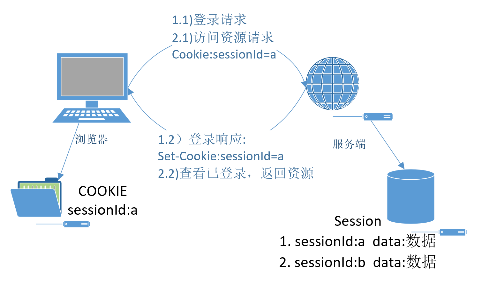

# GoFrame登录实战之cookie&session

## 一、HTTP

超文本传输协议（英文：**H**yper**T**ext **T**ransfer **P**rotocol，缩写：HTTP）是一种用于分布式、协作式和超媒体信息系统的应用层协议。HTTP是万维网的数据通信的基础。**http是一个简单的请求-响应协议，它通常运行在TCP之上。HTTP是无状态的。**

## 二、cookie

Cookie，有时也用其复数形式 Cookies。类型为“小型文本文件”，是某些网站为了辨别用户身份，进行Session跟踪而储存在用户本地终端上的数据（通常经过加密），由用户客户端计算机暂时或永久保存的信息 。


**Cookie 是一个请求首部，**其中含有先前由服务器通过 Set-Cookie  首部投放并存储到客户端的 HTTP cookies。

这个首部可能会被完全移除，例如在浏览器的隐私设置里面设置为禁用cookie。

```
Cookie: <cookie-list>
Cookie: name=value
Cookie: name=value; name2=value2; name3=value3
```

响应首部 **`Set-Cookie`** 被用来由服务器端向客户端发送 cookie

```
# 设置cookie
Set-Cookie: <cookie-name>=<cookie-value> 
# cookie的最长有效时间
Set-Cookie: <cookie-name>=<cookie-value>; Expires=<date>
# 在cookie失效之前需要经过的秒数；
# 假如二者 （指 Expires 和Max-Age） 均存在，那么 Max-Age 优先级更高
Set-Cookie: <cookie-name>=<cookie-value>; Max-Age=<non-zero-digit>
# 指定 cookie 可以送达的主机名
Set-Cookie: <cookie-name>=<cookie-value>; Domain=<domain-value>
# 指定一个 URL 路径，这个路径必须出现在要请求的资源的路径中才可以发送 Cookie 首部
Set-Cookie: <cookie-name>=<cookie-value>; Path=<path-value>
# 一个带有安全属性的 cookie 只有在请求使用SSL和HTTPS协议的时候才会被发送到服务器
Set-Cookie: <cookie-name>=<cookie-value>; Secure
# 设置了 HttpOnly 属性的 cookie 不能使用 JavaScript 经由  Document.cookie 属性、XMLHttpRequest 和  Request APIs 进行访问，以防范跨站脚本攻击（XSS）
Set-Cookie: <cookie-name>=<cookie-value>; HttpOnly
```

## 三、session

Session：在计算机中，尤其是在网络应用中，称为“会话控制”。

Session是另一种记录客户状态的机制，不同的是Cookie保存在客户端浏览器中，而Session保存在服务器上。客户端浏览器访问服务器的时候，服务器把客户端信息以某种形式记录在服务器上。这就是Session。客户端浏览器再次访问时只需要从该Session中查找该客户的状态就可以了。

## 四、sessionId

当用户发送请求的时候，服务器将用户cookie里面记录的session_id和服务器内存中存放的session_id进行比对，从而找到用户相对应的session进行操作。

 在tomcat中session id中用JSESSIONID来表示；

## 五、cookie与session关系



1. 登录页面输入账号密码请求；服务端认证通过，存储session，设置Cookie；
2. 请求资源需要的资源；服务端查看sessionId，判断sessionId是否存在，存在人为已登录返回资源；

