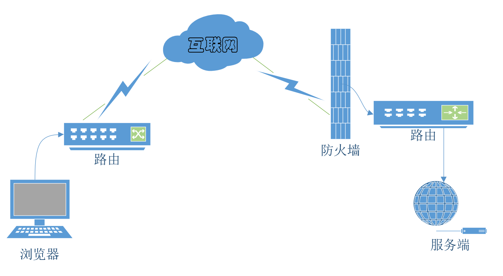

# GoFrame登录实战之登录安全

从整体上看，HTTP就是一个通用的单纯协议机制。因此它具备较多优势，但是在安全性方面则呈劣势。

HTTP的不足

●通信使用明文（不加密），内容可能会被窃听

●不验证通信方的身份，因此有可能遭遇伪装

●无法证明报文的完整性，所以有可能已遭篡改



## 一、在浏览器端HTTP是可以随意修改的

在Web应用中，从浏览器那接收到的HTTP请求的全部内容，都可以在客户端自由地变更、篡改。所以Web应用可能会接收到与预期数据不相同的内容。

客户端校验只是为了用户体验，要保证安全性就一定要做服务端校验；

## 二、避免传输拦截

传输参数进行加密：前端密码进行MD5不可逆加密；

传输使用https协议。

### 三、数据库泄露

安全存储用户密码的原则是：如果网站数据泄露了，密码也不能被还原。

简单的方式是通过md5 多层加密及加盐。比如：

```bash
md5( md5( password + salt )[8:20] )
```

服务端数据库存储密码加密bcrypt

## 四、防止暴力破解

1. 验证码防止暴力破解；
2. 为用户体验，可多次相同ip或帐号错误，再进行验证码验证；
3. 多次同一帐号错误，进行一段时间的帐号锁定。

## 五、常用Web的攻击方式

跨站脚本攻击（Cross-Site Scripting,XSS）

SQL注入攻击（SQL Injection）

系统命令注入攻击（OS Command Injection）

DoS攻击（Denial of Service attack）

### 6、示例

### 目录

```bash
D:.
│  bcrypt_test.go
│  go.mod
│  go.sum
│  main.go
│
├─config
│      config.toml
│      server.crt
│      server.key
│
├─public
│      md5.js
│
├─sql
│      init.sql
│
├─template
│      index.html
│      user_index.html
│
└─test
        test.http
```

### config.toml

```toml
# session存储方式file,memory,redis
SessionStorage = "redis"

[server]
    Address          = ":80"
    ServerRoot       = "public"
    SessionIdName    = "gSessionId"
    SessionPath      = "./gession"
    SessionMaxAge    = "1m"
    DumpRouterMap    = true

# 模板引擎配置
[viewer]
    Path        = "template"
    DefaultFile = "index.html"
    Delimiters  =  ["${", "}"]

# Redis数据库配置
[redis]
    default = "192.168.31.128:6379,0"

[database]
    link = "mysql:root:123456@tcp(192.168.31.128:3306)/gf-login"
```

### main.go

```go
package main

import (
	"github.com/gogf/gf/frame/g"
	"github.com/gogf/gf/net/ghttp"
	"github.com/gogf/gf/os/gsession"
	"github.com/gogf/gf/util/gconv"
)

const SessionUser = "SessionUser"

func main() {
	s := g.Server()

	// 设置存储方式
	sessionStorage := g.Config().GetString("SessionStorage")
	if sessionStorage == "redis" {
		s.SetSessionStorage(gsession.NewStorageRedis(g.Redis()))
		s.SetSessionIdName(g.Config().GetString("server.SessionIdName"))
	} else if sessionStorage == "memory" {
		s.SetSessionStorage(gsession.NewStorageMemory())
	}

	// 常规注册
	group := s.Group("/")
	group.GET("/", func(r *ghttp.Request) {
		r.Response.WriteTpl("index.html", g.Map{
			"title": "登录页面",
		})
	})
	group.POST("/login", func(r *ghttp.Request) {
		username := r.GetString("username")
		password := r.GetString("password")

		record, err := g.DB().Table("sys_user").Where("login_name = ? ", username).One()
		// 查询数据库异常
		if err != nil {
			r.Response.WriteJson(g.Map{
				"code": -1,
				"msg":  err.Error(),
			})
			r.Exit()
		}

		// 直接存入前端传输的
		if password == record["password"].String() {
			// 添加session
			r.Session.Set(SessionUser, g.Map{
				"username": username,
				"realName": record["real_name"].String(),
			})
			r.Response.WriteJson(g.Map{
				"code": 0,
				"msg":  "登录成功",
			})
			r.Exit()
		}

		r.Response.WriteJson(g.Map{
			"code": -1,
			"msg":  "登录失败",
		})
	})

	// 用户组
	userGroup := s.Group("/user")
	userGroup.Middleware(MiddlewareAuth)
	// 列表页面
	userGroup.GET("/index", func(r *ghttp.Request) {
		realName := gconv.String(r.Session.GetMap(SessionUser)["realName"])
		r.Response.WriteTpl("user_index.html", g.Map{
			"title":    "用户信息列表页面",
			"realName": realName,
			"dataList": g.List{
				g.Map{
					"date":    "2020-04-01",
					"name":    "朱元璋",
					"address": "江苏110号",
				},
				g.Map{
					"date":    "2020-04-02",
					"name":    "徐达",
					"address": "江苏111号",
				},
				g.Map{
					"date":    "2020-04-03",
					"name":    "李善长",
					"address": "江苏112号",
				},
			}})
	})
	userGroup.POST("/logout", func(r *ghttp.Request) {
		// 删除session
		r.Session.Remove(SessionUser)

		r.Response.WriteJson(g.Map{
			"code": 0,
			"msg":  "登出成功",
		})
	})

	// 生成秘钥文件
	// openssl genrsa -out server.key 2048
	// 生成证书文件
	// openssl req -new -x509 -key server.key -out server.crt -days 365
	s.EnableHTTPS("config/server.crt", "config/server.key")
	s.SetHTTPSPort(8080)
	s.SetPort(8199)

	s.Run()
}

// 认证中间件
func MiddlewareAuth(r *ghttp.Request) {
	if r.Session.Contains(SessionUser) {
		r.Middleware.Next()
	} else {
		// 获取用错误码
		r.Response.WriteJson(g.Map{
			"code": 403,
			"msg":  "您访问超时或已登出",
		})
	}
}
```

### bcrypt_test.go

```go
package main

import (
	"fmt"
	"github.com/gogf/gf/crypto/gmd5"
	"golang.org/x/crypto/bcrypt"
	"testing"
)

func TestMd5(t *testing.T) {
	md5, _ := gmd5.EncryptString("123456")
	fmt.Println(md5)
}

func TestMd5Salt(t *testing.T) {
	md5, _ := gmd5.EncryptString("123456")
	fmt.Println(md5)
	fmt.Println(gmd5.EncryptString(md5 + "123456"))
}

func TestBcrypt(t *testing.T) {
	passwordOK := "admin"
	passwordERR := "adminxx"

	hash, err := bcrypt.GenerateFromPassword([]byte(passwordOK), bcrypt.DefaultCost)
	if err != nil {
		fmt.Println(err)
	}
	//fmt.Println(hash)

	encodePW := string(hash) // 保存在数据库的密码，虽然每次生成都不同，只需保存一份即可
	fmt.Println("###", encodePW)
	hash, err = bcrypt.GenerateFromPassword([]byte(passwordOK), bcrypt.DefaultCost)
	if err != nil {
		fmt.Println(err)
	}
	encodePW = string(hash) // 保存在数据库的密码，虽然每次生成都不同，只需保存一份即可
	fmt.Println("###", encodePW)
	// 其中：$是分割符，无意义；2a是bcrypt加密版本号；10是cost的值；而后的前22位是salt值；
	// 再然后的字符串就是密码的密文了。

	// 正确密码验证
	err = bcrypt.CompareHashAndPassword([]byte(encodePW), []byte(passwordOK))
	if err != nil {
		fmt.Println("pw wrong")
	} else {
		fmt.Println("pw ok")
	}

	// 错误密码验证
	err = bcrypt.CompareHashAndPassword([]byte(encodePW), []byte(passwordERR))
	if err != nil {
		fmt.Println("pw wrong")
	} else {
		fmt.Println("pw ok")
	}
}
```


